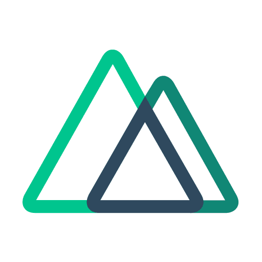

<!-- Programming Languages -->

# Hey there! I'm Alex 👋

💻 **Frontend Developer** — I turn coffee ☕ and ideas 💡 into interactive experiences.  
🌱 Always learning and experimenting with **React & Vue**, **TypeScript**, and modern web technologies.

💡 Passionate about clean code, performance optimization, and creating interfaces that just feel right.  
🚀 My goal? Build products that are **fast, beautiful, and enjoyable to use**.

⚡ Fun fact: I have **9 years in engineering design** before jumping into coding — I still love precision and
visualization.

## 💻 Tech Stack:

## 💻 Codewars:

## 🌐 Socials:

   
